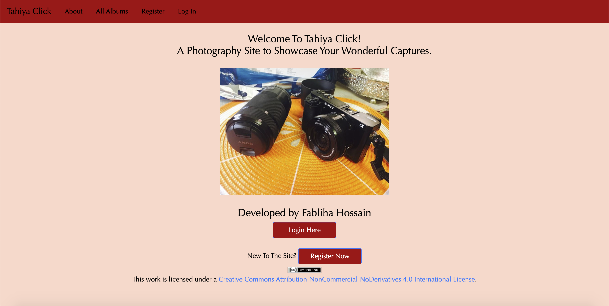
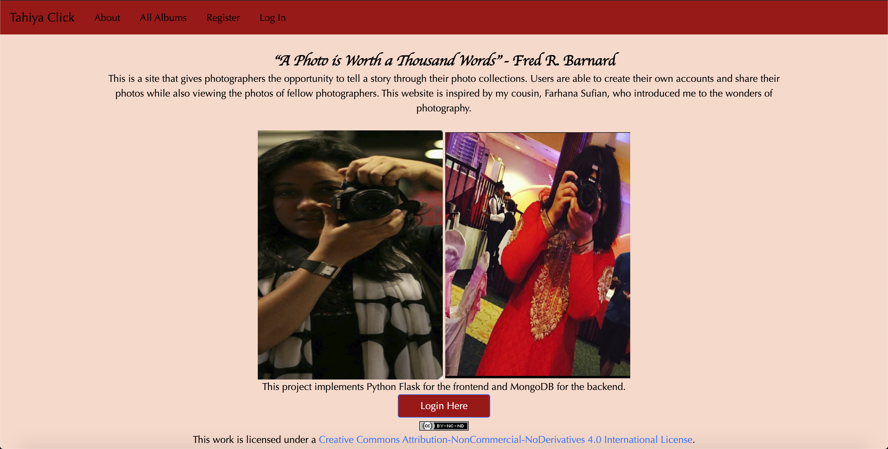
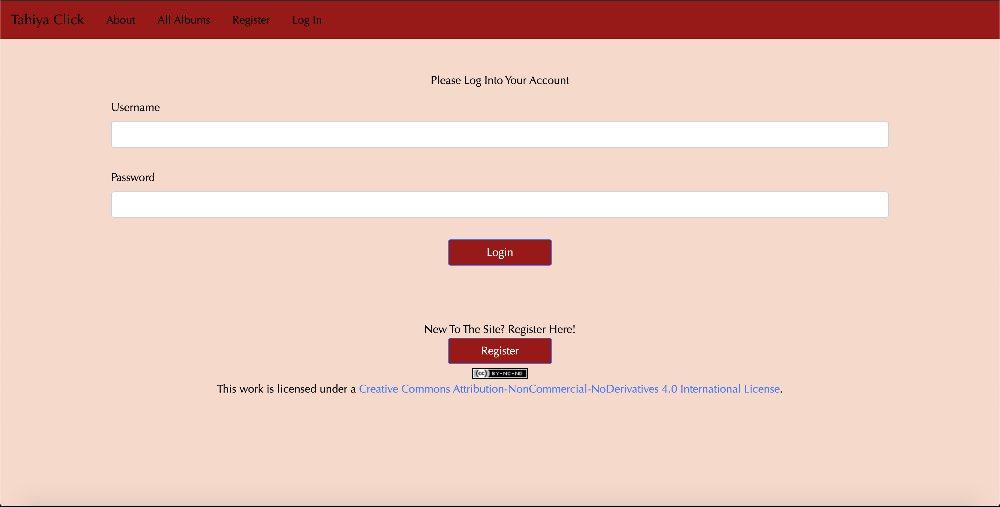
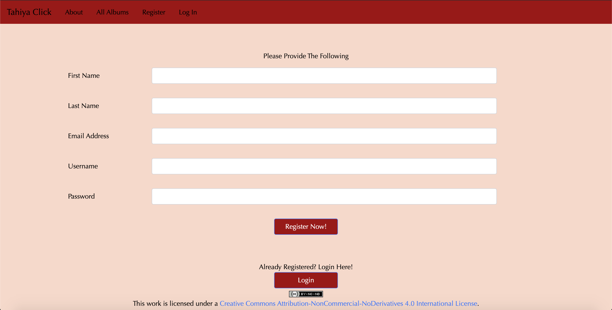

</img> 
# Tahiya Click: A Photography Site
## Developed by Fabliha Hossain

**Project Objective:** They say that a picture is worth a thousand words. The focus of this project was to develop a web application that allows photographers to share their content, as well as any messages, to the world. The idea was inspired by my cousin Farhana Sufian, who introduced me to the wonders of photography.

**Welcome Page:** 
The simple welcome page features my Sony a6000 Professional Camera. This is the camera I use whenever I travel to new areas to capture the beautiful settings of the world. I also use this camera to photoshoot my friends. 

**About Page:** 
The About Page features a little description of the application as well as images of myself and my cousin holding professional cameras. Thereby, it emphasizes that the site is mostly utilized by the person behind the camera. 

**Login Page:** 
A user must log in with a valid username and password, stored in the database, in order to access the rest of the web application. 

**Registration Page:** 
The Registration Page ensures that there are no duplicate email addresses or usernames between any two registered users. In addition to that, the application hashes the user's password using Flask-Hashing for security purposes. 

**Main Albums Page:** 
Based on who logs in, the Main Albums Page filters through all albums in the database. The logged in user can see their own albums on the left side, and the albums of other photographers on the right side. 

**New Album Form:** 
Currently, in order to create a new album in the site, it must have a unique album name and the images uploaded must have the following extensions: 'jpg', 'jpeg', 'png', 'gif'. Any other extensions will flash an error message for the form to be submitted again. 

**Update Album Form:** 
Album users can update their own albums only. They can choose to update the name, description, and cover image of the album. They could also upload new images and/or delete current images from the album. Security measures are implemented to redirect the user if they try to inject an album id that isn't theirs onto the site link (in attempts to access albums that don't belong to them). 

**View Album:** 
Users can view any album of their choice in full. However, the 'update album' option will only appear in the albums that they have complete ownership of. Otherwise, they can simply view all the images by clicking on each them to be enlarged. 

###### Technology Decisions:
* Python Flask
* MongoDB 
* Javascript
	* Bootstrap 4.5
* HTML 

**License Info:** This work is licensed under a *Creative Commons Attribution-NonCommercial-NoDerivatives 4.0 International License*
https://creativecommons.org/licenses/by-nc-nd/4.0/
